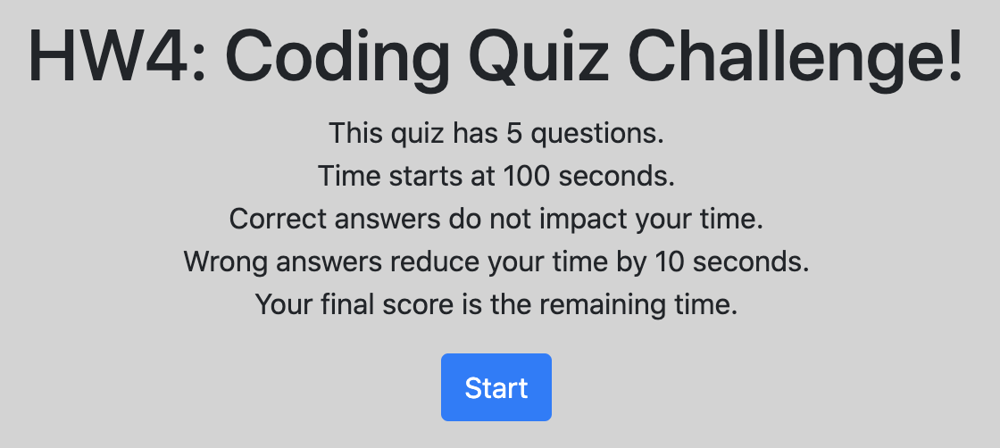
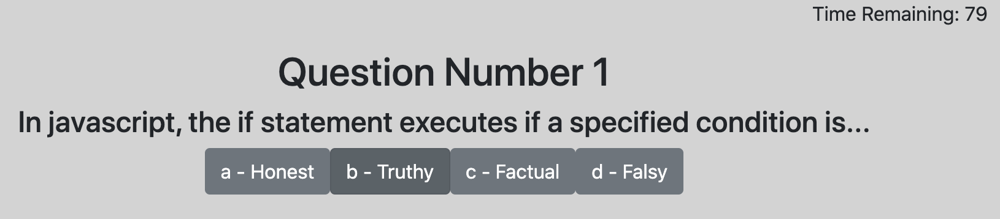
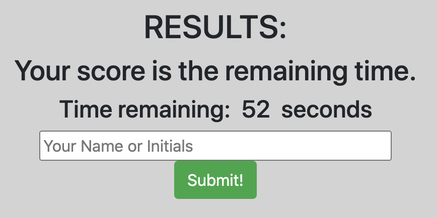
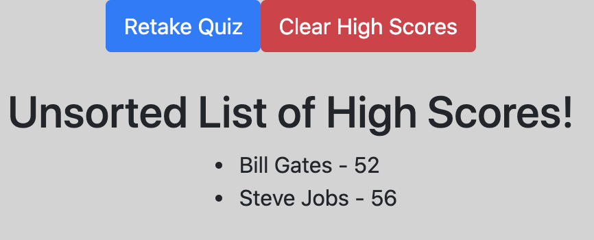

# 4-Web-APIs-Code-Quiz

## Homework 4 Introduction
We were tasked with creating an interactive quiz, consisting of multiple choice questions. When the start button was pushed, a countdown timer would begin. Answering questions correctly would not impact the countdown timer, but answering questions incorrectly would subtract time from the countdown timer. The game would be end if all the questions were completed or if the countdown timer reached zero. Following completion of the game, the user could enter their name, which would be saved in conjunction with their score (which was the time remaining as they completed the quiz). This high score list could be viewed or cleared.

## Deployed Application:
### [https://jpbrickhouse.github.io/4-Web-APIs-Code-Quiz/](https://jpbrickhouse.github.io/4-Web-APIs-Code-Quiz/)

## Screenshots
### Starting the Quiz

### Sample Quiz Questions

### Results

### High Scores Page

## Overall Notes

### index.html
Several divs have been introduced to organize and group content; all of these utilize Bootstrap to enable responsive design functionality.

#### "Navigation" Bar
- While not a formal navigation bar, this top bar was permanently affixed to the top of the page
- It always displayed the time remaining and a link to view the high scores

#### id="introContent"
- When the page first loads, this div is displaying
- It introduces the quiz and explains the rules
- Upon pushing the start button, the style of this div switches to "display:none" and the quizContent loads
- The countdown timer also begins

#### id="quizContent"
- This div is how the quiz itself gets displayed
- The javascript code loads the question and answer choice buttons onto the page and into the buttons, respectively
- This continues as the quiz cycles through the questions
- Upon completion of the quiz - whether from finishing all the questions OR from time running out - the style of this div switches to "display:none" and the endContent loads

#### id="endContent"
- This div displays the score results of the quiz (aka, the time remaining)
- It has also has a submission form, allowing the user to input their name, so that way it will get stored in conjunction with their score
- Upon pushing the submit button, the high score is submitted and saved to localStorage
- Upon pushing the submit button, the following also occurs: the style of this div switches to "display:none" and the restartContent loads 

#### id="restartContent"
- This div has two buttons
- One button restarts the quiz - this is accomplished by simply reloading the html page
- One button takes users to the high score page (a different html file)

### highscores.html
- This page consists of several buttons: Retake Quiz OR Clear High Scores
- This page also has a div where the high scores list will get populated
- The javascript recalls the high scores from localStorage and displays them as an unordered list
- Upon clicking the Retake Quiz button, the other html page is loaded
- Upon clicking the Clear High Score button, localStorage is cleared AND the entire div containing the unordered list is removed (this is not an issue because upon reloading the page, the div still exists in the html, so it can be re-populated)

### style.css
- No major items contained in the CSS
- Just setting a background color for the body

### script2.js
The bulk of the content for this application can be found in the script2 javascript file. Numerous functions, event listeners, buttons, etc. have all been generated in order to ensure the functionality of the quiz game. These items include, but are not limited to, the following:
- countdown() - this function creates and runs the countdown timer, which ultimately serves as the scoring mechanism for the game
- startQuiz() - this changes display styles when the game begins, and shows the content
- populateQuestion() - a function that fills the quiz and answer buttons with the actual questions
- runQuiz() - this function runs populateQuestion() and also adds event listeners to the answer buttons... if an answer button is clicked, the following function runs:
- checkAnswer() - this function is run from within runQuiz, and checks the user's response to the question... after checking the answer, it either continues the quiz or runs endRoutine()
- endRoutine() - this shows the end game content, which includes a display of the user's final score, and an input form where they can input their name... if they enter their name, it is placed in localStorage and associated with their score
- renderHighScores() - displays the high scores in an (unsorted) unordered list
- clearHighScores() - clears the high scores from localStorage

## Final Thoughts
- This project was a challenging exercise, and a great first foray into running multiple functions simulatenously.
- Future implementations of such a game would take advantage of jQuery and improved understanding of javascript.
- Further notes have been commented upon with the code itself.
